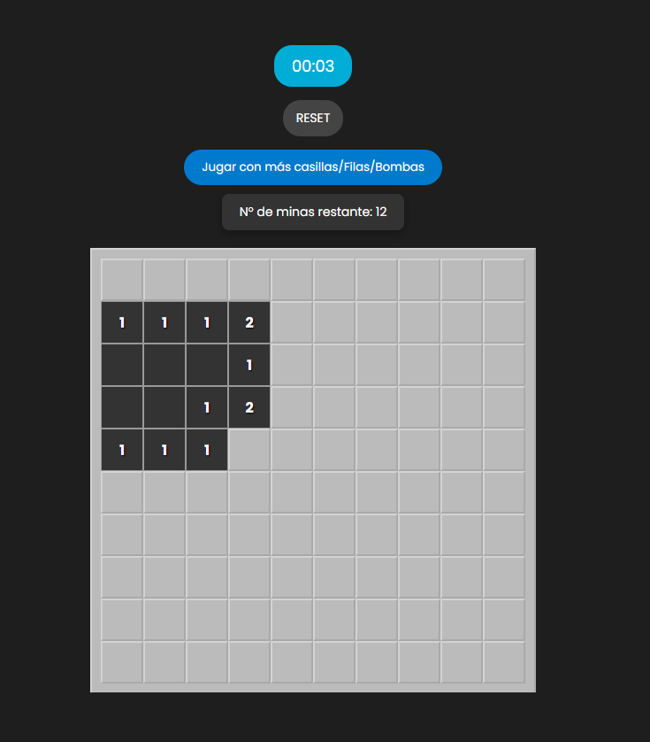

# Buscaminas

Este es un proyecto web que implementa el clásico juego del Buscaminas, utilizando **JavaScript**, **HTML**, y **CSS**.

## Características

- **Pantalla de inicio interactiva**: Antes de comenzar el juego, se muestra una animación donde coches pasan por la parte inferior de la pantalla.
- **Interfaz interactiva**: Haz clic en las casillas para descubrir si contienen una mina.
- **Condiciones de victoria/derrota**: Pierdes si seleccionas una mina o ganas al descubrir todas las casillas sin minas.
- **Diseño responsivo**: Adaptado para diferentes tamaños de pantalla.

